

  

<h1 align="center">Sharpe</h1>

Four practice modes for quant interview prep, in one small app.

  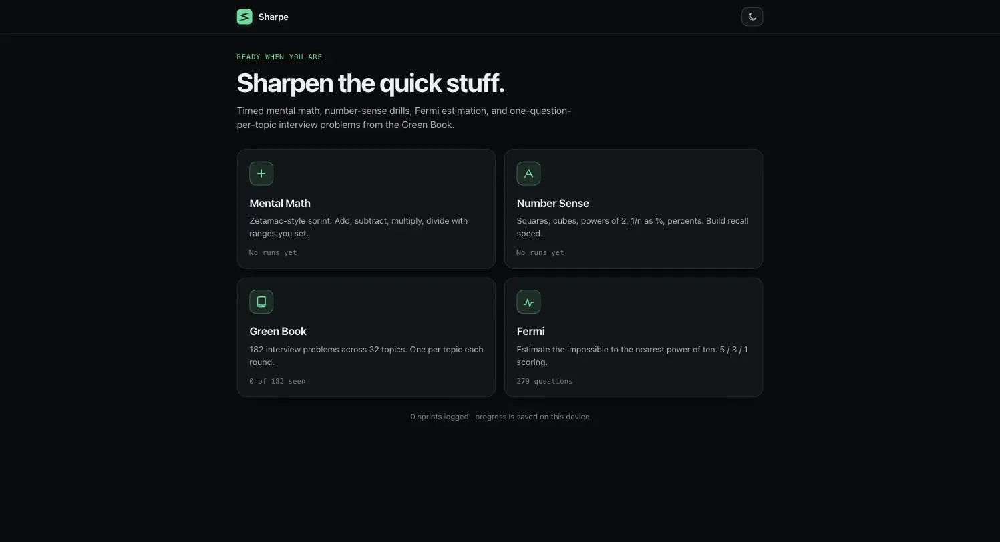

## Modes

### Mental Math
Zetamac-style arithmetic sprint. Toggle +, −, ×, ÷ independently, set the number ranges for each,
and pick a duration from 30s to 5m. Type the answer — it advances the instant it's right, `Enter`
skips. High score is tracked per exact settings.

<table><tr>
<td>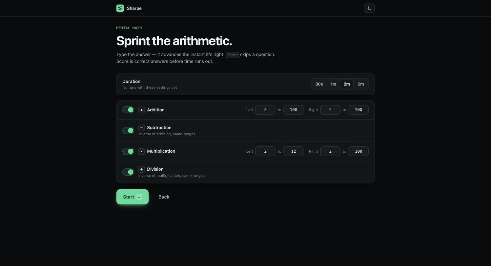</td>
<td>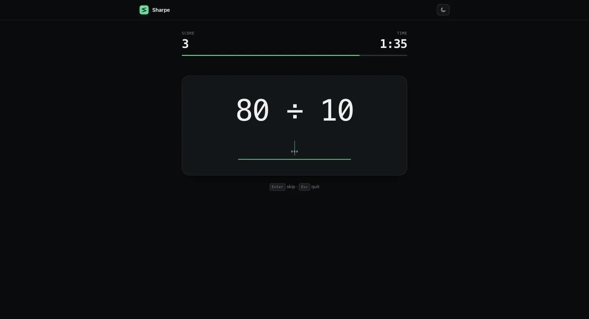</td>
</tr></table>

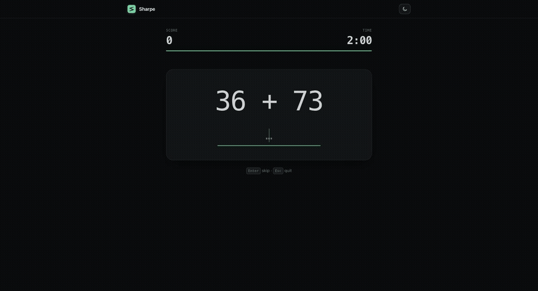

### Number Sense
The same sprint engine, retuned for recall drills: squares (11–35), cubes (2–15), powers of 2
and log₂, 1/n as a percent, percent-of, and mid-range multiplication (12–25 × 12–25). Pick which
drills to mix into a round.

<table><tr>
<td>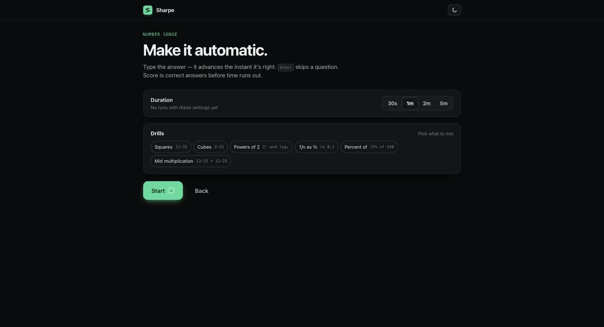</td>
<td>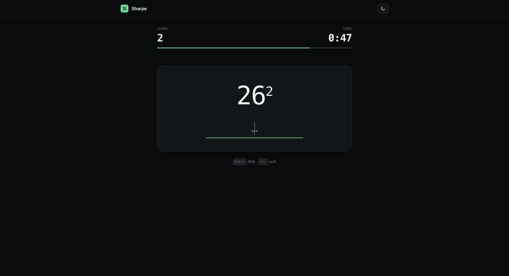</td>
</tr></table>

### Green Book
182 interview problems from *A Practical Guide to Quantitative Finance Interviews*, across 32
topics in 8 chapters. Each round pulls exactly one problem per topic (interleaved, no repeats)
until you've cycled the whole map. `Space` reveals the solution, `1`/`2`/`3` self-grade it,
`H` shows the book's hint (when there is one), `S` skips, and `+`/`-` resize the question text.
Problem titles can be switched off if they give away the trick.

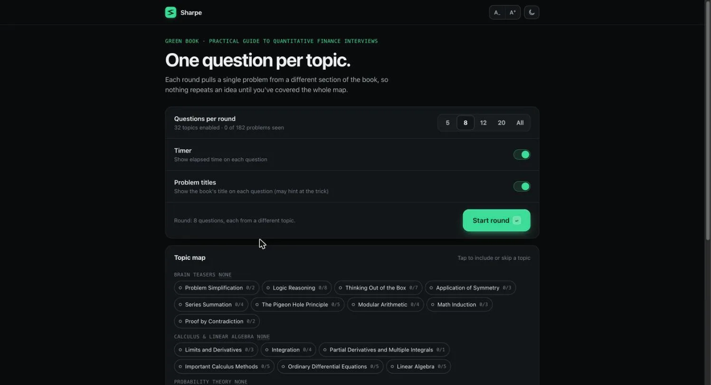

> The scanned problems and solutions themselves aren't pictured here — see
> [Green Book data](#green-book-data) for why.

### Fermi
Order-of-magnitude estimation from the [Fermi Questions](https://fermi-questions.andrechek.com/)
bank — collected from Science Olympiad and other Fermi tests. Answer with the power of ten
(400 is 4×10², so the answer is `2`); scoring is 5 for exact, 3 for one order off, 1 for two off.
Unseen questions come first so a round cycles through sources you haven't hit yet.

<table><tr>
<td>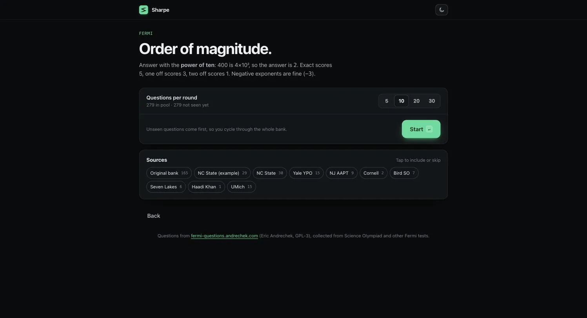</td>
<td>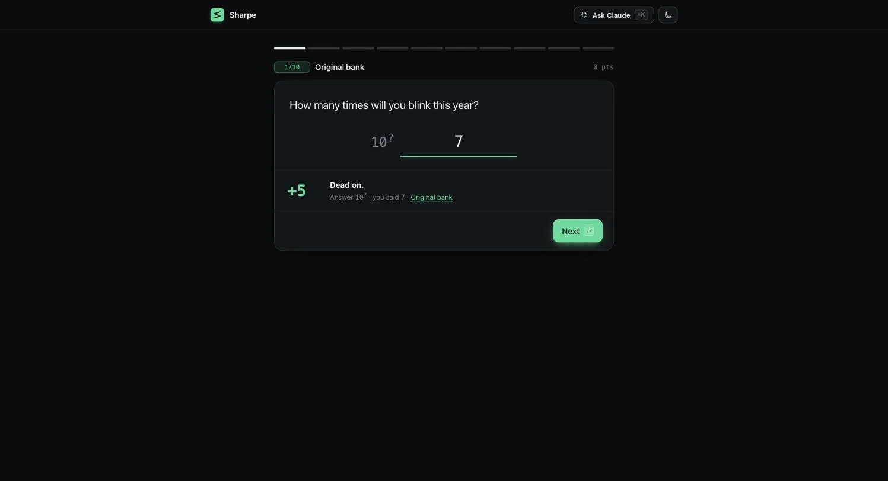</td>
</tr></table>

## Ask Claude (side panel)
On a Green Book or Fermi question, press **⌘K** (or "Ask Claude") to chat about the problem
you're on. Each message includes that problem: for the book, the scanned question (plus the
follow-up's original problem and the hint if you opened it); for Fermi, the question text and
source. The book's solution / the Fermi reference answer are only shared once you've revealed or
answered, so hints stay spoiler-free. The panel lists exactly what Claude can see for that
message.

It runs through your local Claude Code login (`claude` CLI on Sonnet at medium effort, no tools;
the scans are sent inline and each reply shows its token count), so it works in **Sharpe.app**,
not in a plain browser tab.

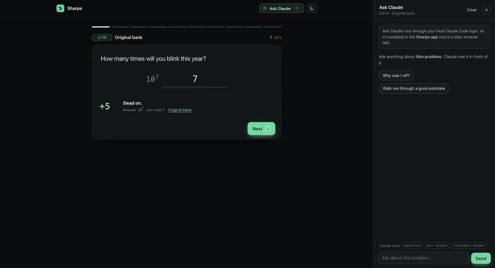

## Appearance
Light and dark themes share one token set; toggle from the header. Progress (scores, streak,
book history, settings) is saved on-device only.

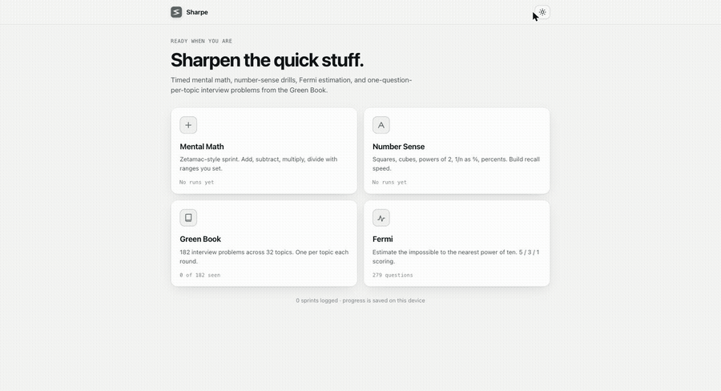

## Run
- **App:** double-click `Sharpe.app` (drag it to /Applications if you like). Rebuild with `native/build.sh`.
- **Browser:** open `index.html`.

The Green Book questions/solutions are crops of your own scan; the folder contains book pages, so don't redistribute it.

## Green Book data
This repo does not include `img/` (the page crops) or `data.js` (titles/structure derived from
the book) — see `NOTICE.md`. `pipeline/` has the scripts that turn your own scan into both,
starting from page images + OCR.
